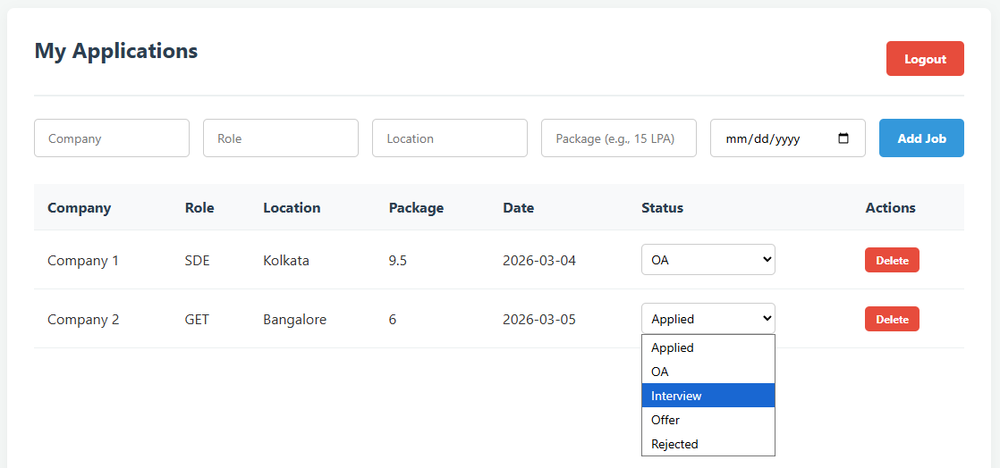

# Smart Job Application Tracker



## Overview
The Smart Job Application Tracker is a full-stack application designed to help developers organize their job search. It features a stateless REST API built with Java 25 and Spring Boot, utilizing JWT for secure authentication. The frontend is a responsive single-page application built with Vanilla JavaScript and CSS.

## Technology Stack
* **Backend:** Java 25, Spring Boot 4.0.3, Spring Security 6, Spring Data JPA, MySQL, Maven
* **Frontend:** HTML5, CSS3, Vanilla JavaScript (Fetch API)
* **Authentication:** JSON Web Tokens (JWT)

## Project Structure
The project follows a standard Maven directory layout with integrated static resources.

```text
smart-job-tracker
├── src/main/java/com/tracker/
│   ├── config/
│   ├── controller/
│   ├── dto/
│   ├── entity/
│   ├── repository/
│   ├── security/
│   └── service/
└── src/main/resources/
    ├── static/
    └── application.properties
```

## Security & Configuration Notes
* **Database Credentials:** In src/main/resources/application.properties, the spring.datasource.password should be updated to match your local MySQL environment. Do not push your actual password to public repositories.

* **JWT Secret Key:** The SECRET key in JwtService.java is currently a placeholder for development. In a production environment, this should be a 256-bit secure string loaded via environment variables to prevent unauthorized token forging.

## API Endpoints

| Method | Endpoint                      | Description                 | Auth    |
|--------|-------------------------------|-----------------------------|---------|
| POST   | /api/auth/register            | Create a new acccount       | Public  |
| POST   | /api/auth/login               | Login and receive JWT       | Public  |
| GET    | /api/applications             | View all users applications | Private |
| POST   | /api/applications             | Add a new job entry         | Private |
| PATCH  | /api/applications/{id}/status | Update application status   | Private |
| DELETE | /api/applications/{id}        | Remove an application       | Private |

## INSTALLATION
1. Create a MySQL database named job_tracker_db.
2. Configure your credentials in application.properties.
3. Run mvn spring-boot:run from the root directory.
4. Access the application at http://localhost:8080.

